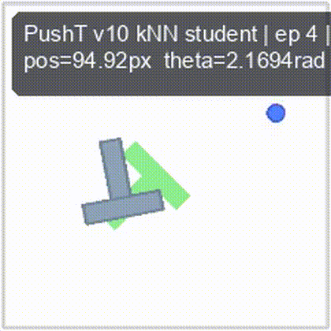

# Meadow WM
### Physics-Grounded Three-Layer Learning Stack for Robot Control

[Sheng-Kai Huang](https://github.com/akaiHuang) · Independent researcher, Taipei

**Abstract:** Modern robot control increasingly couples perception and action into a single pixels-to-actions optimization, leaving physical structure to be recovered by gradient descent over large datasets. We introduce **Meadow**, a three-layer learning stack that factors the problem along physical, statistical, and reactive boundaries: a non-learning physics expansion (Layer 1) that unrolls a causal tree of candidate trajectories under simulator dynamics, a compact neural scorer (Layer 2) trained over the physics-validated branches, and a low-latency reaction policy (Layer 3) distilled from the scorer-selected chain. A named-variable calibration loop closes the system: when deployed behavior diverges from the predicted chain, specific physical parameters are re-estimated locally and the affected layer is re-distilled — without full retraining or new demonstrations. Across four representative tasks (TwoRoom, PushT, Reacher, OGBench Cube) the same expansion–scorer–reaction pipeline reaches 100% heldout success, including 0.81 px sub-pixel reaction precision on PushT contact manipulation. The OGBench v1 four-family API check passes 8/8 with task-specific samples between 443 and 2,724. All training and reaction inference (0.095–0.122 ms via Core ML) run on a single Apple M1 Max — no cloud, no NVIDIA.

<p align="center">
   <b>[ <a href="web/meadow_ami.pdf">Paper</a> | <a href="https://github.com/Hey-Meadow/meadow-wm/tree/main/code">Code</a> | <a href="https://meadow-wm.pages.dev">Website</a> ]</b>
</p>

<br>

<p align="center">
  
</p>

If you find this work useful, please cite:
```bibtex
@techreport{huang2026meadow,
  title  = {Meadow: A Physics-Grounded Three-Layer Learning Stack for Robot Control},
  author = {Huang, Sheng-Kai},
  year   = {2026},
  type   = {Technical report},
  institution = {Independent research, Hey-Meadow Lab},
  url    = {https://github.com/Hey-Meadow/meadow-wm}
}
```

## Using the code
This codebase builds on [stable-worldmodel](https://github.com/galilai-group/stable-worldmodel) (Maes, Le Lidec, Balestriero) for environment management, registry, and wrappers — the same package used by [LeWM](https://github.com/lucas-maes/le-wm). The 11 task-specific reproducer scripts in [`code/`](code/) implement Layer 2 scorer training and Layer 3 reaction-policy distillation; Layer 1 physics expansion is inline within each task script.

**Installation:**
```bash
pip install -r code/requirements.txt
```

Apple Silicon (M1/M2/M3/M4) recommended — MLX-first codebase. Tested on M1 Max.

## Tasks

Four representative tasks span navigation, contact manipulation, arm control, and pick-and-place:

| Task | Causal / Scorer | Success | Precision | Wall-clock |
|---|---|---|---|---|
| TwoRoom (2D nav) | val_acc 0.9990 | 80/80 (100%) | binary terminal | ~48 s |
| PushT (contact) | 4/4 pose-aware guard | 2/2 (100%) | **0.81 px** sub-pixel | ~56 s + ~112 s distill |
| Reacher (arm) | 4/4; median 0.00369 | 2/2 (100%) | mean 0.00494 | ~minutes |
| OGBench Cube (pick-and-place) | val_acc 0.9963 | 4/4 (100%) | phase-conditioned | ~25 s |

**OGBench v1 single-pipeline pass** — same expansion–scorer–reaction code, only spec changes:

| Family | Causal | Reaction | Samples |
|---|---|---|---|
| Cube | 8/8 | 8/8 | 894 |
| PointMaze | 8/8 | 8/8 | 2,724 |
| Scene | 8/8 | 8/8 | 903 |
| Puzzle | 8/8 | 8/8 | 443 |

Reaction inference: 0.095–0.122 ms on Apple M1 Max via Core ML.

## Training

Per-task training scripts live in [`code/`](code/). Each script is self-documenting via `--help`.

```bash
# 1. TwoRoom — train scorer (Layer 2) then student (Layer 3)
python code/train_tworoom_neural_causal_scorer.py --output runs/tworoom_scorer
python code/train_tworoom_causal_student_v2.py --scorer runs/tworoom_scorer

# 2. PushT — distill kNN-exemplar reaction (achieves 0.81 px sub-pixel)
python code/train_pusht_causal_student_v2.py --output runs/pusht_v2

# 3. Reacher — train reaction student
python code/train_reacher_causal_student_v2.py --output runs/reacher_v2

# 4. OGBench Cube — full pipeline
python code/train_ogbench_cube_neural_causal_scorer.py --output runs/cube_scorer
python code/train_ogbench_cube_causal_student.py --scorer runs/cube_scorer --output runs/cube_v2
```

Outputs include `metrics.json` (training curves), `summary.json`, `*.npz` (checkpoints), and `videos/` (rollouts). All wall-clocks are measured on a single Apple M1 Max.

## Evaluation

Each training script supports an evaluation mode that replays the saved checkpoint through heldout episodes — see `--help` on any `train_*.py`. Live demo rollouts (32 successful episodes across the four tasks) are available at the [website](https://meadow-wm.pages.dev) and rendered into the [PDF report](web/meadow_ami.pdf).

## Pretrained Checkpoints

Coming soon — planned upload to Hugging Face. For early access, contact `akai@fawstudio.com`.

## Loading a checkpoint

To be documented once Hugging Face upload is complete. The current snapshot saves checkpoints in `safetensors` format alongside `metrics.json` / `summary.json` in each run output directory.

## Contact & Contributions
Open [issues](https://github.com/Hey-Meadow/meadow-wm/issues)! For questions or collaborations, please contact `akai@fawstudio.com`.

This work is conducted at [Hey-Meadow Lab](https://github.com/Hey-Meadow), an independent research lab grounded in [LeCun's *A Path Towards Autonomous Machine Intelligence* (2022)](https://openreview.net/pdf?id=BZ5a1r-kVsf).
